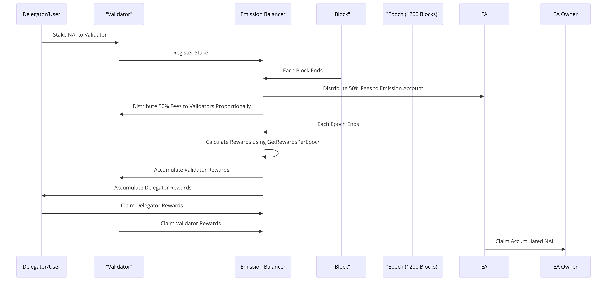

# Emission Balancer and Staking Mechanism

## Introduction

The Emission Balancer is a critical component of the staking and rewards distribution mechanism within the Nuklai network. It is designed to manage and balance the emissions of NAI tokens, ensuring fair and proportional distribution based on stake contributions and validator participation. This documentation provides an in-depth look at its functionalities, the underlying mechanisms, staking rewards calculations, and other relevant features.

### Validator Dynamics

Validators are crucial to the NuklaiVM ecosystem, responsible for processing transactions, creating blocks, and maintaining the blockchain's overall health. Their eligibility and selection are contingent upon the amount of NAI staked, with higher stakes improving their chances of earning more rewards.

### Delegation System

NuklaiVM facilitates a delegated staking system, allowing token holders to delegate their stakes to validators, thus participating in the network's security and earning potential indirectly. This system democratizes the earning process, enabling smaller stakeholders to benefit from the network's growth. The longer the users delegate, the higher their rewards will be when claiming.

## The Emission Balancer

At the heart of NuklaiVM's reward distribution lies the Emission Balancer, a sophisticated algorithm designed to ensure fair and sustainable reward allocation among validators and delegators.

### Dynamic APR and Reward Calculation

The Emission Balancer dynamically adjusts the Annual Percentage Rate (APR), taking into account the total number of active validators and the aggregate staked amount. This ensures that the rewards remain sustainable and proportional to each participant's contribution. Validator rewards are computed based on their staked amount, stake duration, and their performance in validating transactions.

### Stake Tracking and Management

Stakes in NuklaiVM are meticulously tracked, with each staking event—be it registrating validator for staking, withdrawing validator, delegating to validators, or undelegation—prompting an update in the system. This event-driven model ensures that the total staked amount and individual validator stakes are always current, allowing for accurate reward computations.

### Minting of New NAI

The Emission Balancer is responsible for minting new NAI tokens, adhering to predetermined emission schedules and caps. This minting process is directly tied to the validation of new blocks, with freshly minted tokens being distributed as rewards to active validators and delegators based on the calculated reward distribution.

### Fee Distribution Mechanism

Transaction fees collected by NuklaiVM are also managed by the Emission Balancer. A portion of these fees is redistributed as rewards, adding an additional incentive layer for network participants. The distribution follows the same equitable principles, ensuring validators and delegators receive fees proportional to their contributions.

## Key Components

- **Validator**: Represents a node that has staked NAI tokens to participate in the network's consensus mechanism. Validators earn rewards based on their staked amount and the delegations they receive.
- **EmissionAccount**: Holds the unclaimed balance of NAI tokens that are to be distributed as rewards.
- **EpochTracker**: Manages the epochs, which are time periods in which rewards are calculated and distributed. An epoch's length determines how frequently rewards are calculated.

## Functionalities

### Initialization

Upon initialization, the Emission Balancer sets up with the total supply, maximum supply of NAI tokens, and the emission account details. It also establishes a map to track validators and their information.

### Staking and Delegation

Validators can stake NAI tokens to participate in the network, and users can delegate their tokens to validators. The Emission Balancer records and updates these stakes and delegations, adjusting the total staked amount accordingly.

### Reward Calculation

Rewards are calculated based on the Annual Percentage Rate (APR), the total staked amount, and individual validator contributions. The APR can adjust based on the number of validators, ensuring a balance between incentivizing participation and maintaining a sustainable reward rate.

#### APR Adjustment

The APR adjusts inversely with the number of validators beyond a base count, ensuring that as more validators join, the rewards are balanced to prevent inflation.

#### Rewards Per Epoch

At the end of each epoch, the total rewards are calculated based on the APR and the total staked amount. These rewards are then distributed among validators and delegators according to their contributions.

### Reward Distribution

Rewards are distributed at the end of each epoch. Validators and delegators can claim their accumulated rewards. The distribution takes into account the delegation fee rate set by validators, which determines the split between validator earnings and delegator rewards.

### Fee Distribution

Transaction fees are collected and distributed alongside rewards. A portion of the fees goes to the emission account, and the rest is distributed among validators and delegators, similar to reward distribution.

### Withdrawals and Claims

Validators and delegators can withdraw their staked tokens and unclaimed rewards. The Emission Balancer handles these transactions, updating the total staked amount and validator statuses accordingly.

## Under the Hood

### Block Height and Timestamps

The Emission Balancer relies on block height and timestamps to manage epochs and reward distributions. Each block's acceptance into the chain triggers checks against epoch lengths and distribution schedules.

### Validator States

Validators have active and inactive states, determined by their stake start and end times. Only active validators participate in reward distributions.

### Delegator Rewards Calculation

Delegator rewards are calculated based on the amount they have staked with a validator, the duration of the stake, and the rewards allocated for delegators in each epoch.

### Efficient Reward Calculation

To optimize performance, the Emission Balancer calculates rewards per unit staked, reducing the need for iterative calculations across all validators and delegators.

## Features

- **Dynamic APR**: Adjusts based on validator count to ensure a balanced reward system.
- **Epoch-Based Rewards**: Facilitates predictable and regular reward distributions.
- **Delegation Support**: Allows users to delegate tokens to validators, participating indirectly in the consensus mechanism.
- **Transparent Reward Distribution**: Ensures fairness in distributing rewards based on stake contributions.
- **Scalability**: Designed to handle a growing number of validators and delegators efficiently.

## Diagrams

### Mindmap

The mind map covers the following aspects of the Emission Balancer:

- **Initialization**: Setting up with total and maximum supply, along with a validators map.
- **Staking and Delegation**: Recording stakes and updating delegations.
- **Reward Calculation**: Based on APR and stake contributions.
- **Reward Distribution**: Occurring at the end of each epoch and allowing claims of rewards.
- **Fee Distribution**: Handling transaction fees and the emission account.
- **Withdrawals and Claims**: Managing the withdrawal of staked tokens and claiming of unclaimed rewards.

### Component diagram

The Component diagram includes the following classes and their relationships:

- **EmissionBalancer**: The main class managing various operations such as initialization, reward calculations, stake management, and interactions with the blockchain VM.
- **Validator**: Represents a validator in the system with attributes such as NodeID, PublicKey, StakedAmount, and related reward and delegation information.
- **EmissionAccount**: Holds the unclaimed balance of NAI tokens to be distributed as rewards.
- **EpochTracker**: Manages epochs for reward calculation and distribution.
- **NuklaiVM**: Interacts with the underlying blockchain VM for state management, validator information, and block data.

## Sequence diagram

## Architecture Diagram

## Conclusion

The Emission Balancer plays a pivotal role in the Nuklai network's staking ecosystem, ensuring fair reward distributions and incentivizing network participation. Its design considerations for scalability, efficiency, and fairness make it a foundational component for maintaining the network's health and sustainability.
