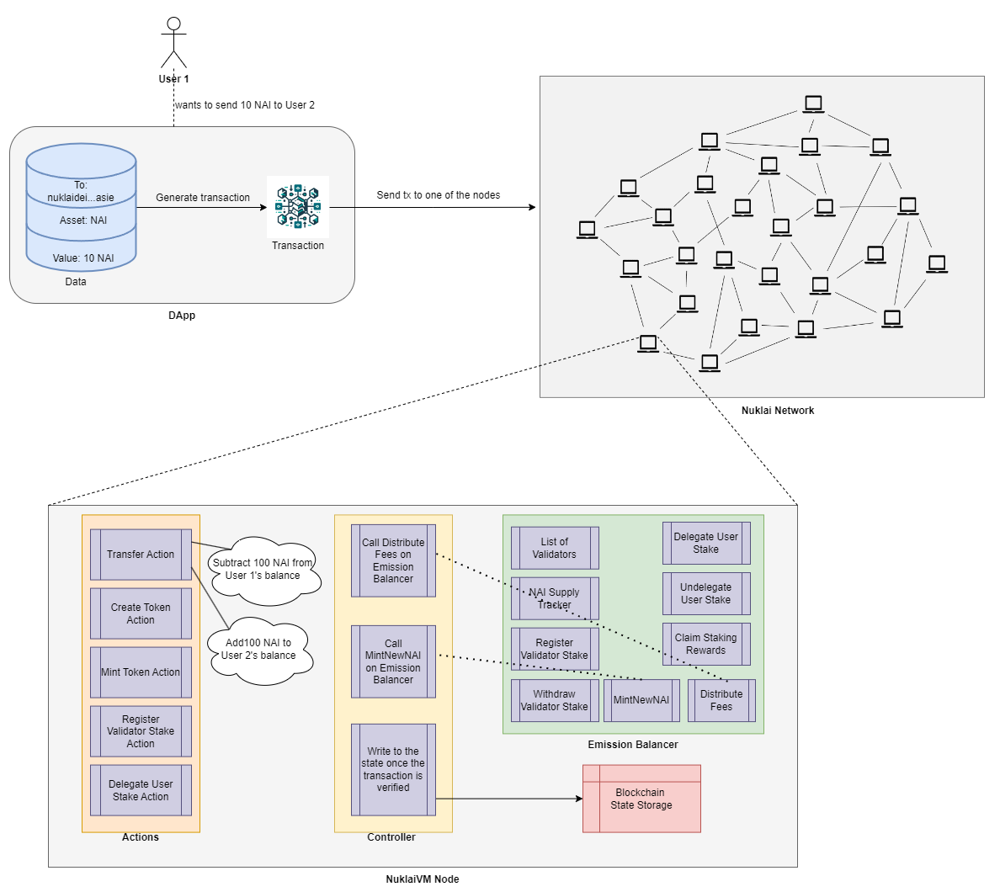

# How to add a new action to a hypervm



Let's go through the process of adding a new action to a hypervm by implementing a "Undelegate User Stake" action. We need to add functionality to both the core vm code and also include it as part of RPC API so external users can interact with the VM easily.

## HyperVM

Since we are going to define our action as part of the VM itself, we need to make changes to the core VM code for nuklaivm.

### 1. vm/vm.go

Register the new action to our vm and our output parser.

```go
  ActionParser.Register(&actions.UndelegateUserStake{}, actions.UnmarshalUndelegateUserStake),
  OutputParser.Register(&actions.UndelegateUserStakeResult{}, actions.UnmarshalUndelegateUserStakeResult),
```

### 2. actions/undelegate_user_stake.go

- Create a new file called `undelegate_user_stake.go`. Here, we need to define some functions that complies with the Action interface defined at [https://github.com/ava-labs/hypersdk/blob/v0.0.17/chain/dependencies.go#L208](https://github.com/ava-labs/hypersdk/blob/v0.0.17/chain/dependencies.go#L208)

- We need to define the following functions:

```go
type Action interface {
 Object

 // ComputeUnits is the amount of compute required to call [Execute]. This is used to determine
 // whether the [Action] can be included in a given block and to compute the required fee to execute.
 ComputeUnits(Rules) uint64

 // StateKeysMaxChunks is used to estimate the fee a transaction should pay. It includes the max
 // chunks each state key could use without requiring the state keys to actually be provided (may
 // not be known until execution).
 StateKeysMaxChunks() []uint16

 // StateKeys is a full enumeration of all database keys that could be touched during execution
 // of an [Action]. This is used to prefetch state and will be used to parallelize execution (making
 // an execution tree is trivial).
 //
 // All keys specified must be suffixed with the number of chunks that could ever be read from that
 // key (formatted as a big-endian uint16). This is used to automatically calculate storage usage.
 //
 // If any key is removed and then re-created, this will count as a creation instead of a modification.
 StateKeys(actor codec.Address, actionID ids.ID) state.Keys

 // Execute actually runs the [Action]. Any state changes that the [Action] performs should
 // be done here.
 //
 // If any keys are touched during [Execute] that are not specified in [StateKeys], the transaction
 // will revert and the max fee will be charged.
 //
 // If [Execute] returns an error, execution will halt and any state changes will revert.
 Execute(
  ctx context.Context,
  r Rules,
  mu state.Mutable,
  timestamp int64,
  actor codec.Address,
  actionID ids.ID,
 ) (codec.Typed, error)
}
```

- Our actions/undelegate_user_stake.go now looks like this:

```go
// Copyright (C) 2024, Nuklai. All rights reserved.
// See the file LICENSE for licensing terms.

package actions

import (
 "context"

 "github.com/ava-labs/avalanchego/ids"
 "github.com/nuklai/nuklaivm/emission"
 "github.com/nuklai/nuklaivm/storage"

 "github.com/ava-labs/hypersdk/chain"
 "github.com/ava-labs/hypersdk/codec"
 "github.com/ava-labs/hypersdk/consts"
 "github.com/ava-labs/hypersdk/state"

 nconsts "github.com/nuklai/nuklaivm/consts"
)

const (
 UndelegateUserStakeComputeUnits = 5
)

var _ chain.Action = (*UndelegateUserStake)(nil)

type UndelegateUserStake struct {
 NodeID ids.NodeID `serialize:"true" json:"node_id"` // Node ID of the validator where NAI is staked
}

func (*UndelegateUserStake) GetTypeID() uint8 {
 return nconsts.UndelegateUserStakeID
}

func (u *UndelegateUserStake) StateKeys(actor codec.Address, _ ids.ID) state.Keys {
 return state.Keys{
  string(storage.BalanceKey(actor, ids.Empty)):          state.Read | state.Write,
  string(storage.DelegateUserStakeKey(actor, u.NodeID)): state.Read | state.Write,
 }
}

func (*UndelegateUserStake) StateKeysMaxChunks() []uint16 {
 return []uint16{storage.BalanceChunks, storage.DelegateUserStakeChunks}
}

func (*UndelegateUserStake) OutputsWarpMessage() bool {
 return false
}

func (u *UndelegateUserStake) Execute(
 ctx context.Context,
 _ chain.Rules,
 mu state.Mutable,
 _ int64,
 actor codec.Address,
 _ ids.ID,
) (codec.Typed, error) {
 exists, stakeStartBlock, stakeEndBlock, stakedAmount, _, ownerAddress, _ := storage.GetDelegateUserStake(ctx, mu, actor, u.NodeID)
 if !exists {
  return nil, ErrStakeMissing
 }
 if ownerAddress != actor {
  return nil, ErrUnauthorizedUser
 }

 // Get the emission instance
 emissionInstance := emission.GetEmission()

 // Check that lastBlockHeight is after stakeEndBlock
 if emissionInstance.GetLastAcceptedBlockHeight() < stakeEndBlock {
  return nil, ErrStakeNotEnded
 }

 // Undelegate in Emission Balancer
 rewardAmount, err := emissionInstance.UndelegateUserStake(u.NodeID, actor)
 if err != nil {
  return nil, err
 }
 if err := storage.DeleteDelegateUserStake(ctx, mu, actor, u.NodeID); err != nil {
  return nil, err
 }
 balance, err := storage.AddBalance(ctx, mu, actor, ids.Empty, rewardAmount+stakedAmount, true)
 if err != nil {
  return nil, err
 }

 return &WithdrawValidatorStakeResult{
  StakeStartBlock:      stakeStartBlock,
  StakeEndBlock:        stakeEndBlock,
  UnstakedAmount:       stakedAmount,
  RewardAmount:         rewardAmount,
  BalanceBeforeUnstake: balance - rewardAmount - stakedAmount,
  BalanceAfterUnstake:  balance,
  DistributedTo:        actor,
 }, nil
}

func (*UndelegateUserStake) ComputeUnits(chain.Rules) uint64 {
 return UndelegateUserStakeComputeUnits
}

func (*UndelegateUserStake) ValidRange(chain.Rules) (int64, int64) {
 // Returning -1, -1 means that the action is always valid.
 return -1, -1
}

var _ chain.Marshaler = (*UndelegateUserStake)(nil)

func (*UndelegateUserStake) Size() int {
 return ids.NodeIDLen
}

func (u *UndelegateUserStake) Marshal(p *codec.Packer) {
 p.PackFixedBytes(u.NodeID.Bytes())
}

func UnmarshalUndelegateUserStake(p *codec.Packer) (chain.Action, error) {
 var unstake UndelegateUserStake
 nodeIDBytes := make([]byte, ids.NodeIDLen)
 p.UnpackFixedBytes(ids.NodeIDLen, &nodeIDBytes)
 nodeID, err := ids.ToNodeID(nodeIDBytes)
 if err != nil {
  return nil, err
 }
 unstake.NodeID = nodeID
 return &unstake, p.Err()
}

var (
 _ codec.Typed     = (*UndelegateUserStakeResult)(nil)
 _ chain.Marshaler = (*UndelegateUserStakeResult)(nil)
)

type UndelegateUserStakeResult struct {
 StakeStartBlock      uint64        `serialize:"true" json:"stake_start_block"`
 StakeEndBlock        uint64        `serialize:"true" json:"stake_end_block"`
 UnstakedAmount       uint64        `serialize:"true" json:"unstaked_amount"`
 RewardAmount         uint64        `serialize:"true" json:"reward_amount"`
 BalanceBeforeUnstake uint64        `serialize:"true" json:"balance_before_unstake"`
 BalanceAfterUnstake  uint64        `serialize:"true" json:"balance_after_unstake"`
 DistributedTo        codec.Address `serialize:"true" json:"distributed_to"`
}

func (*UndelegateUserStakeResult) GetTypeID() uint8 {
 return nconsts.UndelegateUserStakeID
}

func (*UndelegateUserStakeResult) Size() int {
 return 6*consts.Uint64Len + codec.AddressLen
}

func (r *UndelegateUserStakeResult) Marshal(p *codec.Packer) {
 p.PackUint64(r.StakeStartBlock)
 p.PackUint64(r.StakeEndBlock)
 p.PackUint64(r.UnstakedAmount)
 p.PackUint64(r.RewardAmount)
 p.PackUint64(r.BalanceBeforeUnstake)
 p.PackUint64(r.BalanceAfterUnstake)
 p.PackAddress(r.DistributedTo)
}

func UnmarshalUndelegateUserStakeResult(p *codec.Packer) (codec.Typed, error) {
 var result UndelegateUserStakeResult
 result.StakeStartBlock = p.UnpackUint64(true)
 result.StakeEndBlock = p.UnpackUint64(true)
 result.UnstakedAmount = p.UnpackUint64(false)
 result.RewardAmount = p.UnpackUint64(false)
 result.BalanceBeforeUnstake = p.UnpackUint64(false)
 result.BalanceAfterUnstake = p.UnpackUint64(true)
 p.UnpackAddress(&result.DistributedTo)
 return &result, p.Err()
}
```

### 3. consts/types.go

We need to add a new ID for this new action which we are referencing on actions/undelegate_user_stake.go. We can define this ID on consts/types.go:

```go
UndelegateUserStakeID         uint8 = 14
```

### 4. emission/emission.go

We now need to define a new function called `UnstakeFromValidator` that will unstake the NAI tokens from the given validator

```go
// UndelegateUserStake decreases the delegated stake for a validator and rebalances the heap.
func (e *Emission) UndelegateUserStake(nodeID ids.NodeID, actor codec.Address) (uint64, error) {
 e.lock.Lock()
 defer e.lock.Unlock()

 e.log.Info("undelegating user stake",
  zap.String("nodeID", nodeID.String()))

 // Find the validator
 validator, exists := e.validators[nodeID]
 if !exists {
  return 0, ErrValidatorNotFound
 }

 // Check if the delegator exists
 _, exists = validator.delegators[actor]
 if !exists {
  e.log.Error("delegator not found")
  return 0, ErrDelegatorNotFound
 }

 // Calculate rewards while undelegating
 rewardAmount, err := e.CalculateUserDelegationRewards(nodeID, actor)
 if err != nil {
  e.log.Error("error calculating rewards", zap.Error(err))
  return 0, err
 }
 // Ensure AccumulatedDelegatedReward does not become negative
 if rewardAmount > validator.AccumulatedDelegatedReward {
  rewardAmount = validator.AccumulatedDelegatedReward
 }
 validator.AccumulatedDelegatedReward -= rewardAmount

 // Remove the delegator from the list
 delete(validator.delegators, actor)

 // If the validator is inactive and has withdrawn and has no more delegators, remove the validator
 if !validator.IsActive && validator.StakedAmount == 0 && len(validator.delegators) == 0 {
  e.log.Info("removing validator",
   zap.String("nodeID", nodeID.String()))
  delete(e.validators, nodeID)
 }

 e.log.Info("undelegated user stake",
  zap.String("nodeID", nodeID.String()),
  zap.Uint64("rewardAmount", rewardAmount))

 return rewardAmount, nil
}
```

### 5. emission/errors.go

We need to add some error definitions which were referenced on emission/emission.go. We can define these on emission/errors.go:

```go
 ErrValidatorNotFound          = errors.New("validator not found")
 ErrDelegatorNotFound          = errors.New("delegator not found")
```

## RPC API

We technically do not need to define any logic for our RPC API if all we want is for users to call this action we defined above however, if you want to add additional helper functions, we can define them easily via RPC API. An example could be if you wanted to define an RPC API to get the currently staked validators info such as the total amount staked, delegated amount, etc. and also to check out the stake of a delegator.

### 1. emission/emission.go

Let's implement the function `GetStakedValidator` on our Emission Balancer.

```go
// GetStakedValidator retrieves the details of a specific validator by their NodeID.
func (e *Emission) GetStakedValidator(nodeID ids.NodeID) []*Validator {
 e.log.Info("fetching staked validator")

 if nodeID == ids.EmptyNodeID {
  validators := make([]*Validator, 0, len(e.validators))
  for _, validator := range e.validators {
   validators = append(validators, validator)
  }
  return validators
 }

 // Find the validator
 if validator, exists := e.validators[nodeID]; exists {
  return []*Validator{validator}
 }
 return []*Validator{}
}
```

### 2. vm/client.go

We need to define a new function on our RPC Client so users can call this API via external tools like curl, POSTMAN, or third party applications. We can do this on vm/client.go:

```go
func (cli *JSONRPCClient) StakedValidators(ctx context.Context) ([]*emission.Validator, error) {
 resp := new(ValidatorsReply)
 err := cli.requester.SendRequest(
  ctx,
  "stakedValidators",
  nil,
  resp,
 )
 if err != nil {
  return []*emission.Validator{}, err
 }
 return resp.Validators, err
}

func (cli *JSONRPCClient) UserStake(ctx context.Context, owner string, nodeID string) (uint64, uint64, uint64, string, string, error) {
 resp := new(UserStakeReply)
 err := cli.requester.SendRequest(
  ctx,
  "userStake",
  &UserStakeArgs{
   Owner:  owner,
   NodeID: nodeID,
  },
  resp,
 )
 if err != nil {
  return 0, 0, 0, "", "", err
 }
 return resp.StakeStartBlock, resp.StakeEndBlock, resp.StakedAmount, resp.RewardAddress, resp.OwnerAddress, err
}
```

### 3. vm/server.go

We need to also define a corresponding function on our RPC server so whenever users interact with the API from their client, it talks to this server function which in turn calls the function defined in controller/resolutions.go. We can do this on vm/server.go:

```go
type ValidatorsReply struct {
 Validators []*emission.Validator `json:"validators"`
}

func (j *JSONRPCServer) StakedValidators(req *http.Request, _ *struct{}, reply *ValidatorsReply) (err error) {
 _, span := j.vm.Tracer().Start(req.Context(), "Server.StakedValidators")
 defer span.End()

 validators := emissionTracker.GetStakedValidator(ids.EmptyNodeID)
 reply.Validators = validators
 return nil
}

type UserStakeReply struct {
 StakeStartBlock uint64 `json:"stakeStartBlock"` // Start block of the stake
 StakeEndBlock   uint64 `json:"stakeEndBlock"`   // End block of the stake
 StakedAmount    uint64 `json:"stakedAmount"`    // Amount of NAI staked
 RewardAddress   string `json:"rewardAddress"`   // Address to receive rewards
 OwnerAddress    string `json:"ownerAddress"`    // Address of the owner who delegated
}

func (j *JSONRPCServer) UserStake(req *http.Request, args *UserStakeArgs, reply *UserStakeReply) (err error) {
 ctx, span := j.vm.Tracer().Start(req.Context(), "Server.UserStake")
 defer span.End()

 ownerID, err := codec.StringToAddress(args.Owner)
 if err != nil {
  return err
 }
 nodeID, err := ids.NodeIDFromString(args.NodeID)
 if err != nil {
  return err
 }

 exists, stakeStartBlock, stakeEndBlock, stakedAmount, rewardAddress, ownerAddress, err := storage.GetDelegateUserStakeFromState(ctx, j.vm.ReadState, ownerID, nodeID)
 if err != nil {
  return err
 }
 if !exists {
  return ErrUserStakeNotFound
 }

 reply.StakeStartBlock = stakeStartBlock
 reply.StakeEndBlock = stakeEndBlock
 reply.StakedAmount = stakedAmount
 reply.RewardAddress = rewardAddress.String()
 reply.OwnerAddress = ownerAddress.String()
 return nil
}
```

## nuklai-cli

In order to easily test the capability of our new action and our new RPC API, we can integrate them in our nuklai-cli tool. This is not needed but highly encouraged because often times, external users will interact with our VM and giving developers the option to test their new actions via a command line tool is paramount. Think of `nuklai-cli` as a third party application that lets developers quickly interact with different `nuklaivm` features such as the new action we defined above or the `GetUserStake` function we defined above.

### 1. cmd/nuklai-cli/cmd/action.go

Let's define a new command to let users unstake their NAI tokens from the validator they have staked to in the past.

```go
var undelegateUserStakeCmd = &cobra.Command{
 Use: "undelegate-user-stake",
 RunE: func(*cobra.Command, []string) error {
  ctx := context.Background()
  _, priv, factory, cli, ncli, ws, err := handler.DefaultActor()
  if err != nil {
   return err
  }

  // Get current list of validators
  validators, err := ncli.StakedValidators(ctx)
  if err != nil {
   return err
  }
  if len(validators) == 0 {
   utils.Outf("{{red}}no validators{{/}}\n")
   return nil
  }

  // Show validators to the user
  utils.Outf("{{cyan}}validators:{{/}} %d\n", len(validators))
  for i := 0; i < len(validators); i++ {
   utils.Outf(
    "{{blue}}%d:{{/}} NodeID=%s\n",
    i,
    validators[i].NodeID,
   )
  }
  // Select validator
  keyIndex, err := prompt.Choice("validator to unstake from", len(validators))
  if err != nil {
   return err
  }
  validatorChosen := validators[keyIndex]
  nodeID := validatorChosen.NodeID

  // Get stake info
  _, _, stakedAmount, _, _, err := ncli.UserStake(ctx, priv.Address.String(), nodeID.String())
  if err != nil {
   return err
  }

  if stakedAmount == 0 {
   utils.Outf("{{red}}user has not yet delegated to this validator{{/}}\n")
   return nil
  }

  // Confirm action
  cont, err := prompt.Continue()
  if !cont || err != nil {
   return err
  }

  // Generate transaction
  result, _, err := sendAndWait(ctx, []chain.Action{&actions.UndelegateUserStake{
   NodeID: nodeID,
  }}, cli, ncli, ws, factory)
  if err != nil {
   return err
  }
  return processResult(result)
 },
}
```

### 2. cmd/nuklai-cli/cmd/emission.go

Let's now define a new command to let users easily check their current stake on a chosen validator. We can do this on cmd/nuklai-cli/cmd/emission.go:

```go
var emissionStakedValidatorsCmd = &cobra.Command{
 Use: "staked-validators",
 RunE: func(_ *cobra.Command, args []string) error {
  ctx := context.Background()

  // Get clients
  nclients, err := handler.DefaultNuklaiVMJSONRPCClient(checkAllChains)
  if err != nil {
   return err
  }
  ncli := nclients[0]

  // Get validators info
  _, err = handler.GetStakedValidators(ctx, ncli)
  if err != nil {
   return err
  }

  return nil
 },
}
```

### 3. cmd/nuklai-cli/cmd/root.go

We need to add these two new commands to root.go so it's available when users interact with `nuklai-cli`

```go
actionCmd.AddCommand(
  ...
  undelegateUserStakeCmd,
 )
...
emissionCmd.AddCommand(
  ...
  emissionStakedValidatorsCmd,
 )
```

### 4. cmd/nuklai-cli/cmd/handler.go

There is nothing left to do for our unstake validator action however, for the RPC API to get user stake, we need to define this function on handler.go so any other functions can call this function if need be. This is not needed but this is good practice so that multiple functions can reuse the same function.

```go
func (*Handler) GetStakedValidators(
 ctx context.Context,
 cli *vm.JSONRPCClient,
) ([]*emission.Validator, error) {
 validators, err := cli.StakedValidators(ctx)
 if err != nil {
  return nil, err
 }
 for index, validator := range validators {
  publicKey, err := bls.PublicKeyFromBytes(validator.PublicKey)
  if err != nil {
   return nil, err
  }
  utils.Outf(
   "{{blue}}validator %d:{{/}} NodeID=%s PublicKey=%s Active=%t StakedAmount=%d AccumulatedStakedReward=%d DelegationFeeRate=%f DelegatedAmount=%d AccumulatedDelegatedReward=%d\n",
   index,
   validator.NodeID,
   base64.StdEncoding.EncodeToString(publicKey.Compress()),
   validator.IsActive,
   validator.StakedAmount,
   validator.AccumulatedStakedReward,
   validator.DelegationFeeRate,
   validator.DelegatedAmount,
   validator.AccumulatedDelegatedReward,
  )
 }
 return validators, nil
}

func (*Handler) GetUserStake(ctx context.Context,
 cli *vm.JSONRPCClient, owner codec.Address, nodeID ids.NodeID,
) (uint64, uint64, uint64, string, string, error) {
 stakeStartBlock, stakeEndBlock, stakedAmount, rewardAddress, ownerAddress, err := cli.UserStake(ctx, owner.String(), nodeID.String())
 if err != nil {
  return 0, 0, 0, "", "", err
 }
 utils.Outf(
  "{{blue}}user stake: {{/}}\nStakeStartBlock=%d StakeEndBlock=%d StakedAmount=%d RewardAddress=%s OwnerAddress=%s\n",
  stakeStartBlock,
  stakeEndBlock,
  stakedAmount,
  rewardAddress,
  ownerAddress,
 )
 return stakeStartBlock,
  stakeEndBlock,
  stakedAmount,
  rewardAddress,
  ownerAddress,
  err
}
```

This basically prints the user stake to the screen. This is especially useful on our `nuklai-cli` because we can quickly call the RPC API for getting user stake this way.

## Conclusion

That's it! Now, let's see this in action by building `nuklai-cli` and `nuklaivm` and running the vm in our subnet.
